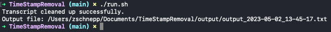
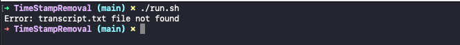

# TimeStampRemoval
Sift through text log removing instances of a specific time stamp.

# How to Configure


# How to Run
Save transcript.txt to working directory.


<!-- GETTING STARTED -->
## Getting Started


### Installation

1. Clone the repo
   ```sh
   CD ~/Documents
   git clone https://github.com/outerfuel/TimeStampRemoval
   ```
2. Place _transcript.txt_ into working directory.

3. Open Terminal and navigate to the cloned directory. Then set the script to be executable
  ```sh
  CD ~/Documents/TimeStampRemoval
  chmod +x ./run.sh
  ```
  

4. Run the command.
  ```sh
  ./run.sh
  ```
  
## Output
Success
  
 
Error
  

<p align="right">(<a href="#readme-top">back to top</a>)</p>
