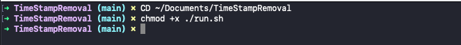

# TimeStampRemoval
Sift through text log removing instances of a specific time stamp.

# How to Configure


# How to Run
Save transcript.txt to working directory.


<!-- GETTING STARTED -->
## Getting Started

* Terminal
  ```sh
  chmod +x ./run.sh
  ```


### Installation

1. Place _transcript.txt_ into working directory.
2. Clone the repo
   ```sh
   git clone https://github.com/your_username_/Project-Name.git
   ```
3. Install NPM packages
   ```sh
   npm install
   ```
4. Enter your API in `config.js`
   ```js
   const API_KEY = 'ENTER YOUR API';
   ```

<p align="right">(<a href="#readme-top">back to top</a>)</p>


<!-- USAGE EXAMPLES -->
## Usage

Use this space to show useful examples of how a project can be used. Additional screenshots, code examples and demos work well in this space. You may also link to more resources.

_For more examples, please refer to the [Documentation](https://example.com)_

<p align="right">(<a href="#readme-top">back to top</a>)</p>
